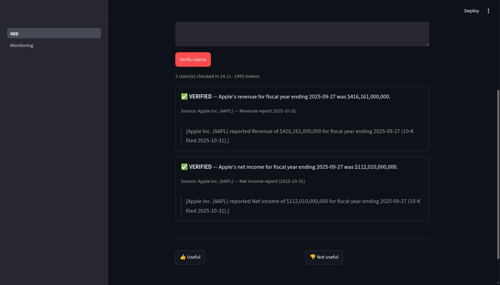
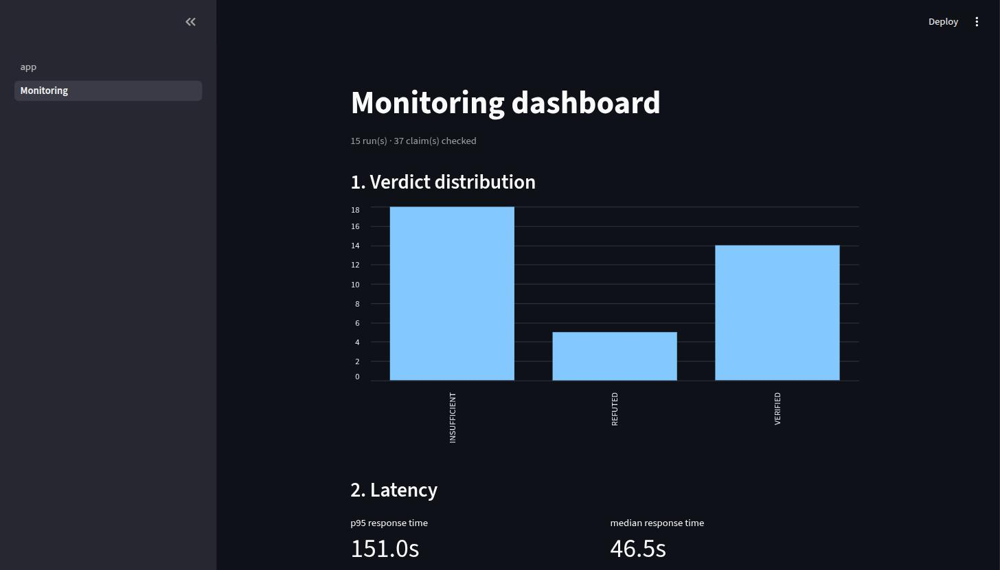
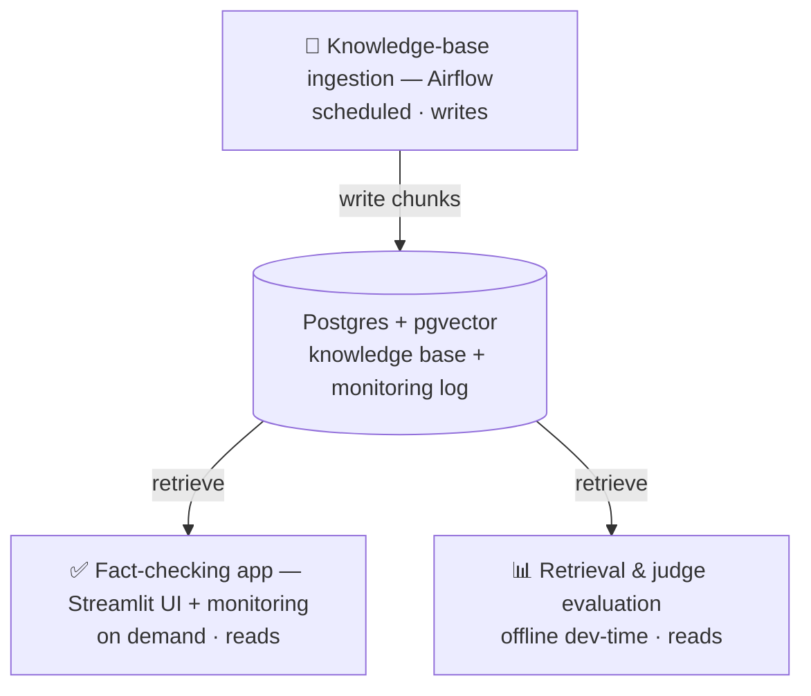
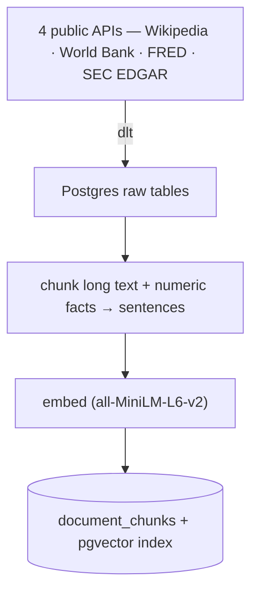
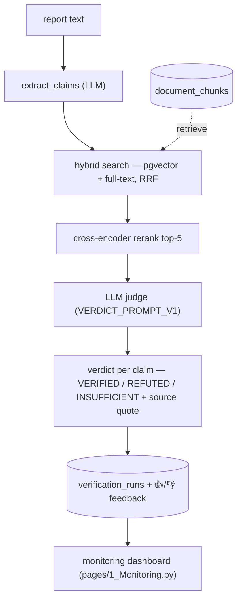
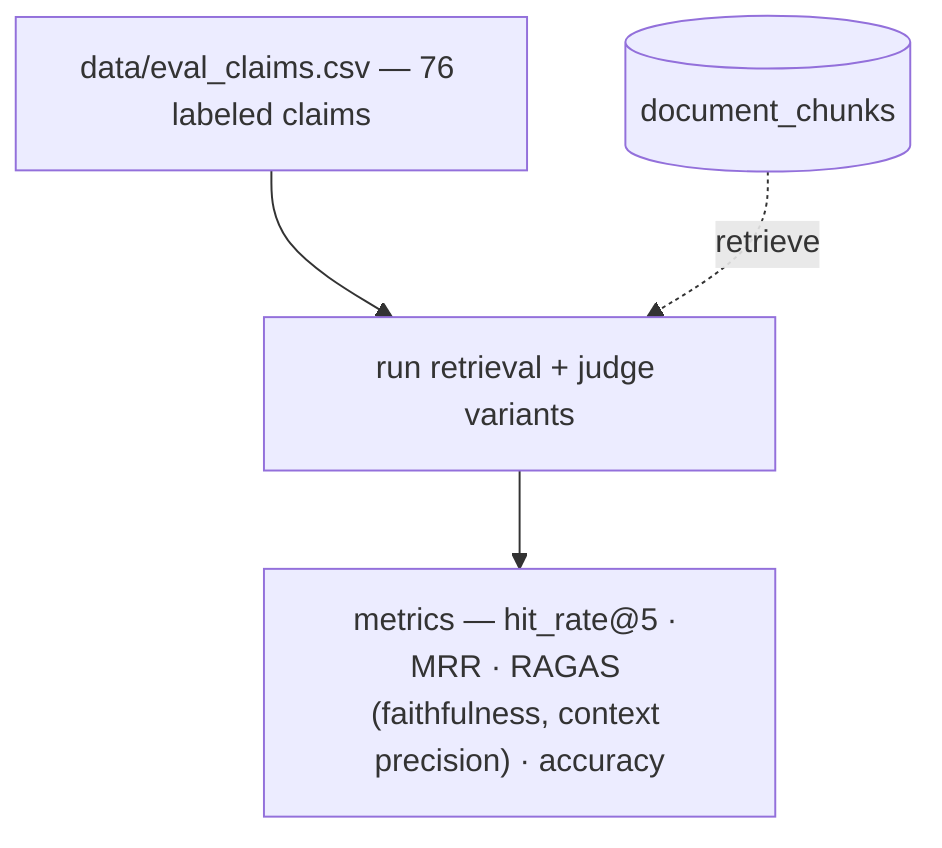

# Fact-Checker RAG

RAG system that checks claims in business reports against public financial and economic sources. LLM Zoomcamp capstone project.

**Problem.** Business reports contain factual errors and hallucinations. The KPMG case is one public example. Checking every number by hand takes hours.

**What it does:**
- Takes report text as input.
- Extracts factual claims from the text.
- Retrieves supporting evidence from a knowledge base built from 4 public sources: Wikipedia (definitions/context), World Bank, FRED, and SEC EDGAR (the actual checkable numbers).
- Returns a verdict per claim: `VERIFIED`, `REFUTED`, or `INSUFFICIENT`.
- Cites the exact source and quote behind each verdict.

**Example:** `"Apple's revenue in FY2023 was $394B"` → checked against SEC EDGAR 10-K → `VERIFIED` + source quote.

**Who it's for:** analysts, auditors, and researchers who verify quantitative claims in reports and don't want to check every number by hand.

**Evaluation — done (Phase 3).** Retrieval, reranking, and query rewriting are all measured, not assumed. Full numbers: [docs/phase-3-evaluation.md](docs/phase-3-evaluation.md). Highlights:
- Compared 8 retrieval methods on a 68-claim labeled set. Hybrid search + reranking wins: 90% hit_rate, 0.890 MRR.
- Compared 2 judge prompts on the full 76-claim set. The simpler prompt wins: 79% accuracy vs. 74%.
- Tested query rewriting on 4 local LLMs. Found a real pattern: the model with the best retrieval score gave the worst final answers. The model with the worst retrieval score gave the best final answers. Retrieval quality and answer quality are not the same thing — see the doc for why.

**Demo:** `uv run streamlit run app.py` (or `docker compose up -d ui` → http://localhost:8501). Hosted demo link lands here once deployed (Phase 5). No report text handy? The app has a "Try an example" dropdown that fills in a known-good sample — more in [docs/manual-qa-reports.md](docs/manual-qa-reports.md).

<p align="center">
  
  
</p>

**Best practices checklist** (per the [course rubric](https://github.com/DataTalksClub/llm-zoomcamp/blob/main/project.md#evaluation-criteria)):
- [x] Hybrid search (text + vector, fused with RRF) — implemented and evaluated.
- [x] Document re-ranking (cross-encoder) — implemented and evaluated.
- [x] Query rewriting — implemented and evaluated across 4 models. Result: it helps retrieval, but not always the final answer. See [docs/phase-3-evaluation.md](docs/phase-3-evaluation.md).

**Why this stack.** RAG + LLM-as-verifier over structured financial data is a pattern used in production fact-checking/audit tools today (e.g. [Hebbia](https://www.hebbia.com/)).

## Architecture

Three independent processes share one Postgres database. **Knowledge-base ingestion** (Airflow, scheduled) writes the knowledge base; the **fact-checking app** (Streamlit, on demand) reads it to check claims; **evaluation** (offline, dev-time) reads it to measure retrieval and judge quality. Nothing runs the other two — the database is the only coupling.



The three processes in detail:

**Knowledge-base ingestion** — builds the searchable knowledge base. Airflow DAG `dags/fact_checker_dag.py`, runs daily.



**Fact-checking app** — the runtime that turns report text into verdicts, plus its monitoring dashboard. Streamlit `app.py`, on demand.



**Retrieval & judge evaluation** — offline measurement, not part of the runtime. Scores retrieval and judge variants against a labeled set.



Each phase is a separate, independently runnable stage of the RAG pipeline.

### Phase 1 — Data + Ingestion

Builds the knowledge base. The foundation for every later phase.

- **Input:** 4 public APIs — Wikipedia, World Bank, FRED, SEC EDGAR.
- **What it does:** fetches each source. Loads raw data into Postgres. Splits long articles into sentence chunks. Turns numeric facts into short sentences. Embeds every chunk into a vector.
- **Output:** a searchable knowledge base — `documents` and `document_chunks` tables in Postgres.

Details: [Phase 1 — Ingestion](docs/phase-1-ingestion.md). Step-by-step tutorial: [notebooks/phase1_ingestion.ipynb](notebooks/phase1_ingestion.ipynb).

### Phase 2 — RAG Pipeline + Orchestration

Turns report text into verified claims, and keeps the knowledge base fresh on a schedule.

- **Input:** raw report text + the Phase 1 knowledge base.
- **What it does:** an LLM (LangChain) extracts factual claims from the text. A vector-search RAG chain retrieves supporting evidence per claim. An Airflow DAG (`dags/fact_checker_dag.py`) re-runs ingestion daily so the knowledge base doesn't go stale.
- **Output:** `POST /verify` endpoint → a verdict per claim — `VERIFIED` / `REFUTED` / `INSUFFICIENT`, with the matched source quote.

```
POST /verify  { "text": "Apple's revenue for fiscal year ending 2025-09-27 was $416,161,000,000." }

→ { "claims": [{ "claim": "...", "verdict": "VERIFIED",
      "source": "Apple Inc. (AAPL) — Revenue",
      "quote": "Apple Inc. (AAPL) reported Revenue of $416,161,000,000 for fiscal year ending 2025-09-27 (10-K filed 2025-10-31)." }] }
```

Details: [Phase 2 — RAG Pipeline + Orchestration](docs/phase-2-rag-pipeline.md). Walkthrough: [notebooks/phase2_rag_pipeline.ipynb](notebooks/phase2_rag_pipeline.ipynb).

### Phase 3 — Hybrid Search + Evaluation

Makes retrieval better. Measures how much better, with real numbers, not guesses.

- **Input:** the Phase 2 chain + a labeled test set (`data/eval_claims.csv`, 76 claims).
- **What it does:** combines pgvector + Postgres full-text search via RRF (`src/db.py`). Reranks top-5 with a cross-encoder. Rewrites the claim before searching, using a local LLM. Scores every step with hit_rate, MRR, and RAGAS (faithfulness, context precision).
- **Output:** a clear retrieval winner (hybrid + rerank), a clear judge-prompt winner (`VERDICT_PROMPT_V1`), and an honest, non-obvious finding on query rewriting. Numbers are at the top of this README; full analysis, diagram, and production recommendation (local vs. cloud) are in the doc.

**Backlog:** `document_chunks.metadata` has a GIN index (`db/init.sql`) but
no query filters on it yet — source-filtered hybrid search could cut
retrieval noise further. See "Further research" in the doc.

Details: [Phase 3 — Evaluation](docs/phase-3-evaluation.md). Step-by-step
tutorial: [notebooks/phase3_evaluation.ipynb](notebooks/phase3_evaluation.ipynb).

### Phase 4 — UI + Monitoring

Makes the project usable and observable by someone who isn't reading code.

- **Input:** the working Phase 2/3 pipeline.
- **What it does:** wraps it in a Streamlit UI (`app.py`) — claim input → verdict cards with sources. Every run (claims, verdicts, token usage, response time) is logged to Postgres (`src/monitoring.py`), with a 👍/👎 feedback button per run. A second page (`pages/1_Monitoring.py`) charts that log: verdict distribution, latency p95, feedback ratio, tokens/query, retrieval hit rate. Same pattern as the course's [05-monitoring](https://github.com/DataTalksClub/llm-zoomcamp/tree/main/05-monitoring) module (`app.py` + `dashboard.py`), adapted to this project's own DB connection and to a native Streamlit multipage app instead of a second script/port.
- **Output:** a live demo (`docker compose up -d ui` → http://localhost:8501, dashboard in the sidebar). A Langfuse-backed version of the same dashboard is a possible follow-up, not required for submission — the metrics are already real, just Postgres-backed instead of a SaaS dashboard.

Details: [Phase 4 — UI + Monitoring](docs/phase-4-ui-monitoring.md).

### Phase 5 — Polish + Submit

Wraps the project up for review.

- **Input:** the finished Phase 1-4 system.
- **What it does:** trims documentation for reviewers, adds screenshots, records a demo video, smoke-tests `docker compose up` on a clean clone.
- **Output:** submitted capstone project.

## Tech stack

100% tools covered in the LLM Zoomcamp course.

| Layer | Tool | Why |
|---|---|---|
| Ingestion | [dlt](https://dlthub.com/) | incremental loads (`merge` write disposition) into per-source raw schemas |
| HTTP | `requests` (shared `ingest/http.py` helper) | no framework needed for 4 simple REST/JSON APIs |
| Storage | Postgres 16 + [pgvector](https://github.com/pgvector/pgvector) | one database for raw staging tables and the vector store — no separate vector DB |
| Embeddings | [sentence-transformers](https://www.sbert.net/) (`all-MiniLM-L6-v2`, 384-dim) | local, free, no API cost — good enough for MVP-scale retrieval |
| Retrieval | pgvector HNSW + Postgres full-text (`tsvector`), fused with RRF, cross-encoder rerank, LLM query rewriting | `src/db.py`, `src/rerank.py`, `src/query_rewrite.py` — all evaluated, see Phase 3 |
| RAG chain | LangChain | claim extraction (`src/claim_extractor.py`) + verifier (`src/verifier.py`), via OpenRouter free tier (model in `src/config.py`) — $0 LLM cost |
| Orchestration | Airflow (`dags/fact_checker_dag.py`) | separate `airflow` service (`Dockerfile.airflow`), scheduled daily ingestion so the KB doesn't go stale |
| Evaluation | RAGAS + LLM-as-judge, done (Phase 3) | hit_rate/MRR per retrieval method, accuracy/faithfulness/context precision per prompt — `eval/compare_retrieval.py`, `eval/ragas_eval.py` |
| Monitoring | Postgres run/feedback log + dashboard (`src/monitoring.py`, `pages/1_Monitoring.py`) | verdict distribution, latency p95, feedback ratio, tokens/query, retrieval hit rate |
| UI | Streamlit (`app.py` + `pages/`) | claim input → verdict cards with sources, monitoring dashboard in sidebar |
| API | FastAPI + uvicorn | `src/api.py` — `/health` + `POST /verify` (claim extraction + verdict) |
| Package/env | [uv](https://docs.astral.sh/uv/) | fast installs, single lockfile |
| Testing | pytest | `tests/` |
| Infra | Docker Compose | one command to bring up Postgres+pgvector |

## Quick start

Both paths need API keys first: `cp .env.example .env`, then fill in
`FRED_API_KEY` ([free](https://fred.stlouisfed.org/docs/api/api_key.html)) and
`OPENROUTER_API_KEY` ([free](https://openrouter.ai/settings/keys)). Every
component reads the same `.env`.

### Option A — Docker (one clean path, recommended for reviewers)

```bash
docker compose up -d postgres                    # DB first (has a healthcheck)

# Populate the knowledge base once (empty until this runs — the app returns
# INSUFFICIENT for everything otherwise). Runs inside the app image:
docker compose run --rm app uv run python -m ingest.fetch_wikipedia
docker compose run --rm app uv run python -m ingest.fetch_worldbank
docker compose run --rm app uv run python -m ingest.fetch_fred
docker compose run --rm app uv run python -m ingest.fetch_secedgar
docker compose run --rm app uv run python -m ingest.build_vector_store

docker compose up -d app ui                      # API → :8000, UI → :8501
```

Open http://localhost:8501 for the Streamlit app (monitoring dashboard in the
sidebar). The `app` service serves `POST /verify` at http://localhost:8000.

### Option B — Local (uv)

```bash
docker compose up -d postgres        # just the DB in Docker
uv sync
uv run python -m ingest.fetch_wikipedia
uv run python -m ingest.fetch_worldbank
uv run python -m ingest.fetch_fred
uv run python -m ingest.fetch_secedgar
uv run python -m ingest.build_vector_store
```

Then start the API and UI **in two separate terminals** (each blocks its shell):

```bash
uv run uvicorn src.api:app --reload     # terminal 1 → API at :8000
uv run streamlit run app.py             # terminal 2 → UI at :8501
```

### Reproduce the evaluation (Phase 3)

Needs a populated knowledge base (ingestion above) + `data/eval_claims.csv` (in the repo):

```bash
uv run python eval/compare_retrieval.py   # hit_rate@5 / MRR per retrieval method
uv run python eval/ragas_eval.py          # accuracy + RAGAS faithfulness / context precision per judge prompt
```

### Tests

```bash
uv run pytest
```

### Scheduled ingestion (optional)

To re-run ingestion on a schedule instead of manually: `docker compose up -d airflow` (builds `Dockerfile.airflow` on first run), then open `http://localhost:8080` (login from `AIRFLOW_ADMIN_*` in `.env`) or `docker exec fact-checker-airflow airflow dags list`. The DAG (`fact_checker_daily_ingestion`) re-runs the 4 `ingest.fetch_*` steps + `ingest.build_vector_store` daily.

## Docs

- [Phase 1 — Ingestion](docs/phase-1-ingestion.md)
- [Phase 1 tutorial notebook](notebooks/phase1_ingestion.ipynb)
- [Phase 2 — RAG Pipeline + Orchestration](docs/phase-2-rag-pipeline.md)
- [Phase 2 walkthrough notebook](notebooks/phase2_rag_pipeline.ipynb)
- [Phase 3 — Evaluation](docs/phase-3-evaluation.md)
- [Phase 3 tutorial notebook](notebooks/phase3_evaluation.ipynb)
- [Phase 4 — UI + Monitoring](docs/phase-4-ui-monitoring.md)
- [Manual QA report examples](docs/manual-qa-reports.md)
