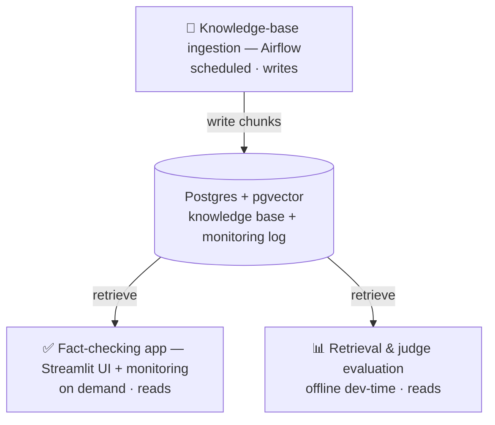
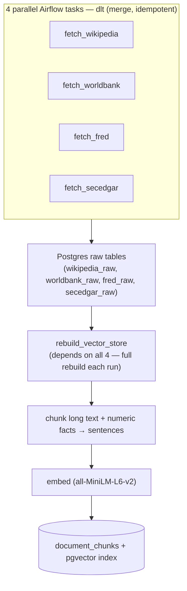
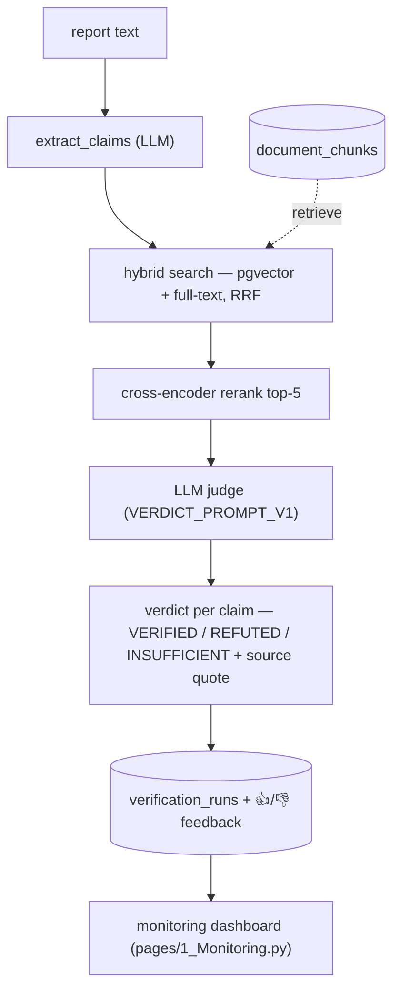
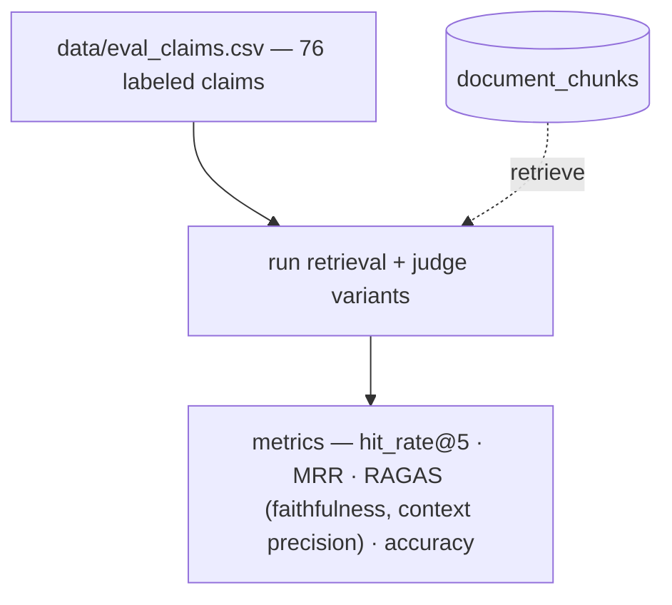

# Fact-Checker RAG

RAG system that checks claims in business reports against public financial and economic sources. LLM Zoomcamp capstone project.

**Problem.** Business reports contain factual errors and hallucinations. The KPMG case is one public example. Checking every number by hand takes hours.

**What it does:**
- Takes report text as input.
- Extracts factual claims from the text.
- Retrieves supporting evidence from a knowledge base built from 4 public sources: Wikipedia (definitions/context), World Bank, FRED, and SEC EDGAR (the actual checkable numbers).
- Returns a verdict per claim: `VERIFIED`, `REFUTED`, or `INSUFFICIENT`.
- Cites the exact source and quote behind each verdict.

**Example:** `"Apple's revenue in FY2023 was $394B"` → checked against SEC EDGAR 10-K → `VERIFIED` + source quote.

**Who it's for:** analysts, auditors, and researchers who verify quantitative claims in reports and don't want to check every number by hand.

**Demo video:**

[](https://youtu.be/oPwMSw2VfWI)

**Demo:** see [Quick start](#quick-start) below. No report text handy? The app has a "Try an example" dropdown that fills in a known-good sample — more in [docs/manual-qa-reports.md](docs/manual-qa-reports.md).

<p align="center">
  <br>
  
</p>

**Why this stack.** RAG + LLM-as-verifier over structured financial data is a pattern used in production fact-checking/audit tools today (e.g. [Hebbia](https://www.hebbia.com/)).

## Evaluation criteria — where to look

| Criterion | Status | Where |
|---|---|---|
| Problem description | ✅ | above |
| RAG flow (knowledge base + LLM) | ✅ | [Architecture](#architecture) |
| Retrieval evaluation | ✅ 8 methods compared, hybrid+rerank wins | [Architecture → evaluation](#architecture), [docs/phase-3-evaluation.md](docs/phase-3-evaluation.md) |
| LLM (judge) evaluation | ✅ 2 prompts compared | same |
| Interface | ✅ Streamlit UI + FastAPI API | [Architecture → fact-checking app](#architecture), [Quick start](#quick-start) |
| Ingestion pipeline | ✅ automated — dlt + Airflow DAG | [Architecture → ingestion](#architecture) |
| Monitoring | ✅ user feedback + 5-chart dashboard | [Architecture → fact-checking app](#architecture) |
| Containerization | ✅ full stack in docker-compose | [Quick start](#quick-start) |
| Reproducibility | ✅ one-command paths, dataset in repo | [Quick start](#quick-start), [Dataset](#dataset) |
| Best practices (hybrid search, re-ranking, query rewriting) | ✅ all 3, all evaluated | [Best practices](#best-practices) |

## Architecture

Three independent processes share one Postgres database. **Knowledge-base ingestion** (Airflow, scheduled) writes the knowledge base; the **fact-checking app** (Streamlit, on demand) reads it to check claims; **evaluation** (offline, dev-time) reads it to measure retrieval and judge quality. Nothing runs the other two — the database is the only coupling.



The three processes in detail:

**Knowledge-base ingestion** — builds the searchable knowledge base. Airflow DAG `dags/fact_checker_dag.py`, runs daily. Fetches 4 public APIs (Wikipedia, World Bank, FRED, SEC EDGAR), loads raw data into Postgres, splits long text into sentence chunks, turns numeric facts into short sentences, embeds every chunk.



Details: [docs/phase-1-ingestion.md](docs/phase-1-ingestion.md). Tutorial notebook: [notebooks/phase1_ingestion.ipynb](notebooks/phase1_ingestion.ipynb).

**Fact-checking app (interface + monitoring)** — the runtime that turns report text into verdicts. Streamlit `app.py`, on demand: claim input → verdict cards with source + quote, 👍/👎 feedback per run. A `POST /verify` API (`src/api.py`) exposes the same pipeline without the UI. Every run (claims, verdicts, tokens, response time) is logged to Postgres; a second Streamlit page (`pages/1_Monitoring.py`) charts it — verdict distribution, latency p95, feedback ratio, tokens/query, retrieval hit rate.



Runnable example: [Quick start](#quick-start).

Details: [docs/phase-2-rag-pipeline.md](docs/phase-2-rag-pipeline.md) (RAG flow), [docs/phase-4-ui-monitoring.md](docs/phase-4-ui-monitoring.md) (UI + monitoring). Walkthrough notebook: [notebooks/phase2_rag_pipeline.ipynb](notebooks/phase2_rag_pipeline.ipynb).

**Retrieval & judge evaluation** — offline measurement, not part of the runtime. Scores retrieval and judge variants against a labeled set (`data/eval_claims.csv`), so the winners above are measured, not assumed:
- Compared 8 retrieval methods on a 68-claim labeled set. Hybrid search + reranking wins: 90% hit_rate, 0.890 MRR.
- Compared 2 judge prompts on the full 76-claim set. The simpler prompt wins: 79% accuracy vs. 74%.
- Tested query rewriting on 4 local LLMs. Found a real pattern: the model with the best retrieval score gave the worst final answers, and vice versa — retrieval quality and answer quality are not the same thing. See the doc for why.



**Backlog:** `document_chunks.metadata` has a GIN index (`db/init.sql`) but no query filters on it yet — source-filtered hybrid search could cut retrieval noise further. See "Further research" in the doc.

Details: [docs/phase-3-evaluation.md](docs/phase-3-evaluation.md). Tutorial notebook: [notebooks/phase3_evaluation.ipynb](notebooks/phase3_evaluation.ipynb).

## Best practices

Per the [course rubric](https://github.com/DataTalksClub/llm-zoomcamp/blob/main/project.md#evaluation-criteria):
- [x] Hybrid search (text + vector, fused with RRF) — implemented and evaluated.
- [x] Document re-ranking (cross-encoder) — implemented and evaluated.
- [x] Query rewriting — implemented and evaluated across 4 models. Result: it helps retrieval, but not always the final answer. See [docs/phase-3-evaluation.md](docs/phase-3-evaluation.md).

## Tech stack

100% tools covered in the LLM Zoomcamp course.

| Layer | Tool | Why |
|---|---|---|
| Ingestion | [dlt](https://dlthub.com/) | incremental loads (`merge` write disposition) into per-source raw schemas |
| HTTP | `requests` (shared `ingest/http.py` helper) | no framework needed for 4 simple REST/JSON APIs |
| Storage | Postgres 16 + [pgvector](https://github.com/pgvector/pgvector) | one database for raw staging tables and the vector store — no separate vector DB |
| Embeddings | [sentence-transformers](https://www.sbert.net/) (`all-MiniLM-L6-v2`, 384-dim) | local, free, no API cost — good enough for MVP-scale retrieval |
| Retrieval | pgvector HNSW + Postgres full-text (`tsvector`), fused with RRF, cross-encoder rerank, LLM query rewriting | `src/db.py`, `src/rerank.py`, `src/query_rewrite.py` — all evaluated, see [Architecture → evaluation](#architecture) |
| RAG chain | LangChain | claim extraction (`src/claim_extractor.py`) + verifier (`src/verifier.py`), via OpenRouter free tier (model in `src/config.py`) — $0 LLM cost |
| Orchestration | Airflow (`dags/fact_checker_dag.py`) | separate `airflow` service (`Dockerfile.airflow`), scheduled daily ingestion so the KB doesn't go stale |
| Evaluation | RAGAS + LLM-as-judge | hit_rate/MRR per retrieval method, accuracy/faithfulness/context precision per prompt — `eval/compare_retrieval.py`, `eval/ragas_eval.py` |
| Monitoring | Postgres run/feedback log + dashboard (`src/monitoring.py`, `pages/1_Monitoring.py`) | verdict distribution, latency p95, feedback ratio, tokens/query, retrieval hit rate |
| UI | Streamlit (`app.py` + `pages/`) | claim input → verdict cards with sources, monitoring dashboard in sidebar |
| API | FastAPI + uvicorn | `src/api.py` — `/health` + `POST /verify` (claim extraction + verdict) |
| Package/env | [uv](https://docs.astral.sh/uv/) | fast installs, single lockfile |
| Testing | pytest | `tests/` |
| Infra | Docker Compose | one command to bring up Postgres+pgvector |

## Dataset

Two datasets, both in the repo — no external download needed.

**Knowledge base** — built from 4 public APIs, not synthetic: Wikipedia (definitions), World Bank + FRED (economic indicators), SEC EDGAR (company financials, the actual checkable numbers). Fetched by `ingest/fetch_*.py`, see [Architecture](#architecture).

**Evaluation set** — [`data/eval_claims.csv`](data/eval_claims.csv), 76 hand-labeled claims (`id, claim, expected_verdict, source_hint`). Covers all 4 sources plus deliberate knowledge-base misses (e.g. tickers/series not ingested) to exercise the `INSUFFICIENT` path, not just the happy path.

## Quick start

**Prerequisites:**
- Docker + Docker Compose
- Python 3.11+
- [uv](https://docs.astral.sh/uv/getting-started/installation/) — only for Option B or the eval/test commands below; Option A runs everything in containers.
  ```bash
  curl -LsSf https://astral.sh/uv/install.sh | sh
  ```

**API keys** — both options read the same `.env`, every service picks it up via `env_file`:

```bash
cp .env.example .env
```

Fill in 2 values, both free:
- `FRED_API_KEY` — register at [fredaccount.stlouisfed.org](https://fred.stlouisfed.org/docs/api/api_key.html), key issued instantly.
- `OPENROUTER_API_KEY` — grab one at [openrouter.ai/settings/keys](https://openrouter.ai/settings/keys).

Everything else in `.env.example` (Postgres credentials, Airflow admin login) already has a working default — leave as is unless you want to change them.

### Option A — Docker (one clean path, recommended for reviewers)

```bash
docker compose up -d postgres                    # DB first (has a healthcheck)

# Populate the knowledge base once (empty until this runs — the app returns
# INSUFFICIENT for everything otherwise). Runs inside the app image:
docker compose run --rm app uv run --frozen --no-dev python -m ingest.fetch_wikipedia
docker compose run --rm app uv run --frozen --no-dev python -m ingest.fetch_worldbank
docker compose run --rm app uv run --frozen --no-dev python -m ingest.fetch_fred
docker compose run --rm app uv run --frozen --no-dev python -m ingest.fetch_secedgar
docker compose run --rm app uv run --frozen --no-dev python -m ingest.build_vector_store

docker compose up -d --build app ui              # API → :8000, UI → :8501
```

`--build` avoids a stale `ui` image on repeat runs against an existing
checkout (fresh clones aren't affected — there's no cached image yet).

Verify the knowledge base actually populated (all 4 sources, thousands of chunks —
if this is empty or missing a source, the app will return `INSUFFICIENT` for
everything):

```bash
docker exec fact-checker-db psql -U factchecker -d factchecker -c "SELECT source, count(*) FROM documents GROUP BY source;"
docker exec fact-checker-db psql -U factchecker -d factchecker -c "SELECT count(*) FROM document_chunks;"
```

Verify it's up:

```bash
curl http://localhost:8000/health   # → {"status": "ok"}
```

Open http://localhost:8501 for the Streamlit app (monitoring dashboard in the
sidebar). The `app` service also serves `POST /verify` at http://localhost:8000 directly:

```bash
curl -s -X POST http://localhost:8000/verify \
  -H "Content-Type: application/json" \
  -d '{"text": "Apple'"'"'s revenue for fiscal year ending 2025-09-27 was $416,161,000,000."}'
```

```json
{ "claims": [{ "claim": "...", "verdict": "VERIFIED",
      "source": "Apple Inc. (AAPL) — Revenue",
      "quote": "Apple Inc. (AAPL) reported Revenue of $416,161,000,000 for fiscal year ending 2025-09-27 (10-K filed 2025-10-31)." }] }
```

### Option B — Local (uv)

```bash
docker compose up -d postgres        # just the DB in Docker
uv sync
uv run python -m ingest.fetch_wikipedia
uv run python -m ingest.fetch_worldbank
uv run python -m ingest.fetch_fred
uv run python -m ingest.fetch_secedgar
uv run python -m ingest.build_vector_store
```

Then start the API and UI **in two separate terminals** (each blocks its shell):

```bash
uv run uvicorn src.api:app --reload     # terminal 1 → API at :8000
uv run streamlit run app.py             # terminal 2 → UI at :8501
```

Verify the knowledge base populated (same check as Option A above, `postgres` is the
same container either way):

```bash
docker exec fact-checker-db psql -U factchecker -d factchecker -c "SELECT source, count(*) FROM documents GROUP BY source;"
```

Verify it's up: `curl http://localhost:8000/health` → `{"status": "ok"}`

### Reproduce the evaluation (many LLM calls — see note below on free-tier vs. ollama)

Needs a populated knowledge base (ingestion above) + `data/eval_claims.csv` (in the repo):

```bash
uv run python eval/compare_retrieval.py   # hit_rate@5 / MRR per retrieval method
uv run python eval/ragas_eval.py          # accuracy + RAGAS faithfulness / context precision per judge prompt
```

- Both make real LLM calls (`rewrite_query()`, `verify_claim()`) — slow and prone to
  transient `429`s on the default free-tier OpenRouter model (auto-retried, expected
  on a shared free tier, not a bug).
- `ragas_eval.py` samples 10 claims by default for this reason; pass
  `sample_size=None` in `main()` for the full 76-claim set.
- To avoid the wait: set `LLM_PROVIDER=ollama` in `.env` (fully local, no rate limit,
  `ollama pull granite4.1:3b` first) — already wired in `src/config.py`, no code
  changes needed. Numbers in
  [docs/phase-3-evaluation.md](docs/phase-3-evaluation.md) were measured on the
  default model; another provider may score slightly differently.

### Tests

```bash
uv run pytest
```

### Scheduled ingestion (optional)

To re-run ingestion on a schedule instead of manually:

```bash
docker compose up -d airflow   # builds Dockerfile.airflow on first run
```

Open http://localhost:8080 (login from `AIRFLOW_ADMIN_*` in `.env`) and unpause `fact_checker_daily_ingestion`, or trigger it from the CLI:

```bash
docker exec fact-checker-airflow airflow dags list                              # confirm it loaded
docker exec fact-checker-airflow airflow dags unpause fact_checker_daily_ingestion
docker exec fact-checker-airflow airflow dags trigger fact_checker_daily_ingestion
```

**Troubleshooting: `:8080` not reachable after `docker compose up -d airflow`.** Check
`docker logs fact-checker-airflow` for `Error: Already running on PID ... (or pid file
'/opt/airflow/airflow-webserver.pid' is stale)`. The `airflow_home` volume persists
across restarts — if the webserver didn't shut down cleanly last time, its stale PID
file blocks the next start (scheduler/triggerer come up fine, only the webserver
fails). Fix:

```bash
docker exec fact-checker-airflow rm -f /opt/airflow/airflow-webserver.pid
docker compose restart airflow
```

The DAG re-runs the 4 `ingest.fetch_*` steps + `ingest.build_vector_store` daily — the same steps as the manual ingestion above, just scheduled.

## Further reading

Per-component deep dives (design decisions, full numbers, further research) linked inline in [Architecture](#architecture) above. Also see:

- [Manual QA report examples](docs/manual-qa-reports.md) — 27 paste-in test blocks for the Streamlit app
