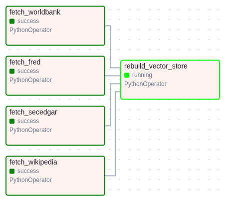

# Phase 2 — RAG Pipeline + Orchestration

**Status: not started.** This doc is the plan, written before any Phase 2 code
exists, so implementation can follow it instead of improvising. Update this
file as design decisions land or change — don't let it go stale like the
Phase 1 doc almost did.

## Goal

Turn raw report text into a list of verified claims, and keep the Phase 1
knowledge base from going stale.

- **Input:** raw report text (paragraph or full document) + the Phase 1
  knowledge base (`documents` / `document_chunks`, 6846 chunks).
- **Output:** `POST /verify` → a list of claims, each with a verdict
  (`VERIFIED` / `REFUTED` / `INSUFFICIENT`), the matched source, and a direct
  quote.

Two independent pieces: the verify pipeline (claim extraction → retrieval →
verdict) and the ingestion scheduler (Airflow DAG). They don't depend on each
other and can be built in either order.

## 1. Claim extraction

An LLM reads the report text and pulls out checkable factual claims —
numbers, dates, amounts tied to a specific entity ("Apple's revenue for
FY2025 was $416.161B"), not opinions or forward-looking statements.

Open design decisions:

- **Model:** OpenRouter by default, not OpenAI directly — `OPENROUTER_API_KEY` +
  `LLM_MODEL=tencent/hy3:free` in `.env.example` (same pattern as
  `llm-zoomcamp-hw2`: OpenAI-compatible client,
  `base_url="https://openrouter.ai/api/v1"`). Free-tier model, $0 cost —
  fits a capstone with no LLM budget. Originally tried
  `nvidia/nemotron-3-ultra-550b-a55b:free`, but that model's provider was
  returning `DEGRADED function cannot be invoked` on every call (confirmed
  with a bare `openai` client too, not a code bug) — swapped to
  `tencent/hy3:free`, verified working with structured output via
  `ChatOpenAI(...).with_structured_output(...)`.
- **Local fallback:** `LLM_PROVIDER=ollama` (`src/config.py`) switches to a
  local Ollama model (`ornith:latest`, `base_url=http://localhost:11434/v1`,
  dummy `api_key`) — no API key, no rate limits, works offline. Verified
  working with the same `with_structured_output` call. Caveat: CPU-only on
  this machine, ~20s/call once warm, 2+ min cold start — fine as a dev
  fallback when OpenRouter free tier is degraded or rate-limited, not a
  latency-sensitive default.
- **Third option, `LLM_PROVIDER=groq`** (`qwen/qwen3.6-27b`) — fast, free, but
  `with_structured_output()` 400s on it (Groq's strict `json_schema` only
  supports `gpt-oss` models). Use a `gpt-oss` model if picking groq.
- **Responses API:** `chat_llm()` sets `use_responses_api=True` — all three
  providers support it (confirmed via `curl`, not docs). No effect on
  structured output; cleans up plain-call reasoning/answer separation.
- `langchain` + `langchain-openai` added to `pyproject.toml`.
- **Output schema:** structured output (function calling / `with_structured_output`)
  so extraction returns a typed list, not text to re-parse — e.g.
  `[{claim: str, entity: str, metric: str, value: float, date: str}]`.
- **Source-type hint:** would help Phase 3's backlogged source-filtered
  retrieval (see README) if extraction also guesses which source a claim
  belongs to (`secedgar` / `worldbank` / `fred` / `wikipedia`). Nice-to-have,
  not required for a first working `/verify`.

## 2. RAG chain (retrieval → verdict)

Retrieval already existed — nothing new needed there. `src/db.py` has
`text_search`, `vector_search`, `hybrid_search` (RRF), all benchmarked in
`eval/compare_retrieval.py`. `src/verifier.py` calls `hybrid_search` per
claim (still the best guess — no eval numbers yet to confirm it beats plain
vector search; that's Phase 3's job).

**Done:** `src/verifier.py`'s `verify_claim(claim, prompt=VERDICT_PROMPT_V1)` —
LLM-as-judge over the top-5 retrieved chunks, returns a `Verdict`
(`verdict` / `source` / `quote`) via structured output. Went with
LLM-as-judge for everything (not the rule-based numeric-tolerance idea
below) — simplest to implement, and it's the same mechanism Phase 3
evaluates anyway. `prompt` is an explicit function argument, not hardcoded,
specifically so Phase 3 can pass a second prompt variant at the same call
site for the "LLM evaluation, 2 prompts" rubric line.

Verified against one claim from each `data/eval_claims.csv` bucket:
`VERIFIED` (Apple revenue, correct value), `REFUTED` (Apple revenue,
wrong value — same source chunk, judge caught the mismatch),
`INSUFFICIENT` (Netflix — not in the KB, judge correctly declined to
guess from an unrelated chunk instead of hallucinating a match).

Considered but not built — a rule-based path for numeric claims (parse
the number out of the claim and the retrieved fact-sentence, compare with
a tolerance; the eval set's `REFUTED` rows are gross mismatches like
Apple's revenue off by $166B, so tolerance-checking might get most of the
way without an LLM call). Skipped for now — Wikipedia-sourced definitional
claims would still need the LLM path anyway, so it'd be a second code path
for uncertain latency/cost savings. Revisit only if `/verify` latency
becomes a real problem.

**`INSUFFICIENT` handling:** confirmed above — the judge is instructed not
to force a match when no retrieved chunk actually covers the claim's
entity+metric, rather than relying on an empty-results check (retrieval
always returns top-k, even when nothing relevant exists).

**Source quote:** `Verdict.quote` is the actual retrieved chunk text, not a
paraphrase — confirmed in the test above (`quote` matches
`document_chunks.content` verbatim).

## 3. API — `POST /verify`

**Done.** `src/api.py` wires `extract_claims` → `verify_claim` per claim:

```
POST /verify
{ "text": "<report text>" }

→ 200
{ "claims": [
    { "claim": "Apple reported revenue of $416,161,000,000 for fiscal year ending 2025-09-27.",
      "verdict": "VERIFIED", "source": "Apple Inc. (AAPL) — Revenue",
      "quote": "Apple Inc. (AAPL) reported Revenue of $416,161,000,000 for fiscal year ending 2025-09-27 (10-K filed 2025-10-31)." },
    ...
  ]
}
```

Tested end-to-end against a live server (`uvicorn src.api:app`) with a
3-claim report text: `VERIFIED` (correct Apple revenue), `INSUFFICIENT`
(Netflix, not in KB), `REFUTED` (wrong Apple revenue figure) — all three
verdicts correct.

**Known rough edge:** on the `REFUTED` case, `source`/`quote` came back
`null` instead of the contradicting chunk — the judge got the verdict right
but didn't always fill the citation fields for `REFUTED` the way it does for
`VERIFIED`. Prompt says to quote for both; model doesn't always comply.
Worth tightening as part of Phase 3's prompt-optimization backlog item
(the meta-prompt-refinement pass) rather than patching now.

## 4. Orchestration — Airflow DAG



Re-runs Phase 1 ingestion on a schedule so the KB doesn't go stale.

- **Input:** nothing but the `@daily` schedule trigger + secrets from `.env`
  (`FRED_API_KEY`, etc.) + whatever's already in the `*_raw` Postgres
  schemas. Each `ingest.fetch_*` dlt resource is `write_disposition="merge"`
  on its own primary key, so re-running a fetch is idempotent.
- **Output:** refreshed `wikipedia_raw` / `worldbank_raw` / `fred_raw` /
  `secedgar_raw` schemas, then a full truncate-and-rebuild of the derived
  `documents` / `document_chunks` vector store that `src/db.py`'s hybrid
  search reads from.
- **DAG shape** (`dags/fact_checker_dag.py`): 4 independent `fetch_*`
  `PythonOperator` tasks (one per source, no dependency between them) →
  `rebuild_vector_store` downstream of all four, since
  `build_vector_store.run()` re-reads every `*_raw` table from scratch on
  each run (full rebuild, fixed 2026-07-07, see
  [Phase 1 doc](phase-1-ingestion.md) — no incremental upsert exists yet).
- **Design principles:** the DAG is pure orchestration — it imports each
  ingest module's existing `run()` entrypoint and doesn't reimplement any
  fetch/chunk/embed logic (single responsibility stays in
  `ingest/fetch_*.py` / `ingest/build_vector_store.py`). Adding a new
  source later means one new `ingest/fetch_*.py` + one new task; no
  existing task changes (open/closed). The DAG depends only on the stable
  `run()` interface each module already exposes, not on dlt/psycopg2
  internals (dependency inversion).
- **Runtime:** separate `airflow` service in `docker-compose.yml`
  (`Dockerfile.airflow`, `apache/airflow:2.10.5-python3.11` +
  `requirements-airflow.txt` — just the ingestion deps: dlt, psycopg2,
  pgvector, sentence-transformers, requests, python-dotenv; deliberately
  *not* langchain/ragas/fastapi, since the DAG never touches the RAG/eval/
  API layers). `standalone` mode (single container, SQLite metadata db) —
  enough for a capstone, avoids a second Postgres just for Airflow's own
  state. `dags/`, `src/`, `ingest/` are bind-mounted so local edits apply
  without a rebuild.
- **Verified:** `airflow dags list` shows `fact_checker_daily_ingestion`
  with no import errors; `airflow tasks list` shows all 5 tasks; a real
  `airflow tasks test ... fetch_wikipedia` run completed end-to-end
  (dlt → Postgres, load package `LOADED`, task `SUCCESS`).
- **Not production-grade, by choice:** `standalone` prints Airflow's own
  warning — SQLite metadata DB + SequentialExecutor are dev/test only.
  Concretely: `standalone_command.py` detects `sqlite` in
  `sql_alchemy_conn` and force-sets `AIRFLOW__CORE__EXECUTOR=SequentialExecutor`
  (source-confirmed) — this serializes *all* tasks in the instance, so the
  4 `fetch_*` tasks run one at a time even though they're independent in
  the DAG graph. Fine for a capstone (4 short API calls, seconds of
  difference); intentionally not fixed now. **Path to production**, if this
  ever needs to run for real (also unlocks the 4 fetch tasks running in
  parallel, not just proper HA):
  point `AIRFLOW__DATABASE__SQL_ALCHEMY_CONN` at a Postgres database (a
  second DB in the existing `postgres` service, or its own service) and set
  `AIRFLOW__CORE__EXECUTOR=LocalExecutor`; replace `command: standalone` in
  `docker-compose.yml` with `airflow db init` + separate
  webserver/scheduler processes (or services).

## Task breakdown

- [x] Add `langchain`, `langchain-openai` to `pyproject.toml`
- [x] Claim extractor module (`src/claim_extractor.py`) with structured output —
      verified against both OpenRouter (`tencent/hy3:free`) and local Ollama
      (`ornith:latest`)
- [x] Verdict logic (LLM-as-judge first pass) wired to `hybrid_search`
      (`src/verifier.py`) — verified against a VERIFIED/REFUTED/INSUFFICIENT
      case from each bucket of `data/eval_claims.csv`. Prompt passed as an
      explicit arg (`VERDICT_PROMPT_V1`), not hardcoded, so Phase 3 can swap
      in a second variant for the "LLM evaluation, 2 prompts" rubric line
- [x] `POST /verify` in `src/api.py` — tested end-to-end against a live
      server, 3/3 verdicts correct (source/quote null on the REFUTED case
      is a known rough edge, see §3)
- [x] Airflow service (`Dockerfile.airflow`, `requirements-airflow.txt`,
      `docker-compose.yml`) + DAG file (`dags/fact_checker_dag.py`) — built,
      smoke-tested (`dags list`, `tasks list`, `tasks test fetch_wikipedia`
      all green), 2026-07-11
- [ ] Manual smoke test against a few `data/eval_claims.csv` rows before
      Phase 3 runs the full RAGAS evaluation

[← Back to README](../README.md)
