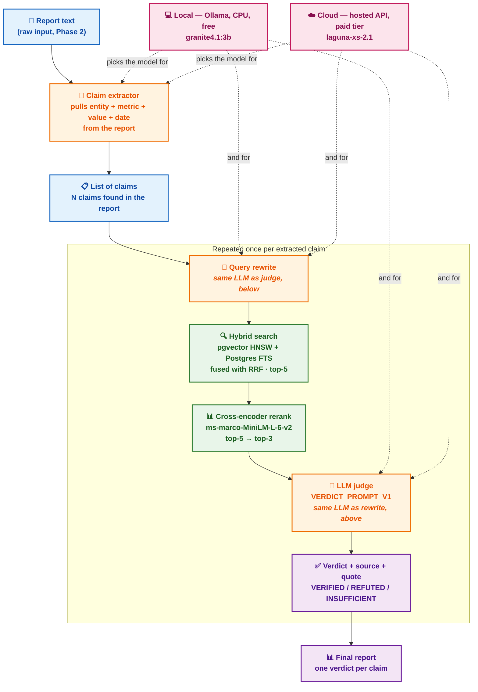

# Phase 3 — Hybrid Search + Evaluation

**Status: done.** Retrieval, reranking, LLM-judge prompts, and query
rewriting are all implemented and measured. Full transcripts and code:
`notebooks/phase3_evaluation.ipynb`.

## Metrics

- **hit_rate@k** — did the correct document appear in the top-k results?
- **MRR@k** — how high did it rank? 1st place scores 1.0, 2nd scores 0.5, and so on.
- **Faithfulness** (RAGAS) — does the verdict trace back to the retrieved evidence?
- **Context precision** (RAGAS) — was the retrieved evidence actually relevant?
- **Accuracy** — does the verdict match the labeled answer in `data/eval_claims.csv`?

## Retrieval evaluation

Tested on 68 labeled claims (`eval/compare_retrieval.py`):

| Method | hit_rate@5 | MRR@5 |
|---|---|---|
| minsearch | 85% | 0.853 |
| Postgres full-text | 78% | 0.664 |
| pgvector | 88% | 0.873 |
| hybrid (RRF) | 90% | 0.860 |
| **hybrid + rerank** | **90%** | **0.890** |

Hybrid search + cross-encoder reranking wins. It's the retrieval path
`verify_claim()` uses. Reranking adds a second pass with a cross-encoder
(`src/rerank.py`, `cross-encoder/ms-marco-MiniLM-L-6-v2`): slower per chunk
than the bi-encoder embedding search, so it only scores the top-5
candidates hybrid search already found, not the whole knowledge base.

7 claims still miss (all FRED claims). The cause: a source collision, not
a vocabulary gap. "US GDP in Q3 2019" retrieves World Bank's GDP figure
instead of FRED's — same concept, different source, close enough
lexically that hybrid search picks the wrong one. Query rewriting targets
this directly (see below).

## LLM judge evaluation

Two prompts compared on the full 76-claim set, both prompts, run locally
(`eval/ragas_eval.py`):

| Prompt | Accuracy | Faithfulness | Context precision |
|---|---|---|---|
| **`VERDICT_PROMPT_V1`** | **79%** (60/76) | 0.748 | **0.669** |
| `VERDICT_PROMPT_V2` | 74% (56/76) | 0.747 | 0.587 |

`VERDICT_PROMPT_V1` wins on accuracy and context precision, ties on
faithfulness. It's `verifier.py`'s default — no change needed.

`VERDICT_PROMPT_V2` asks the judge to reason step by step before deciding.
It produces more `INSUFFICIENT` verdicts, which explains its lower
accuracy.

**Bug found and fixed:** RAGAS's faithfulness score returns `NaN` for
verdicts with no clear factual statement (mostly `INSUFFICIENT` ones). The
original averaging code summed `NaN` straight in, so one such claim
silently zeroed out the whole average. Fixed in `eval/ragas_eval.py` to
drop `NaN` scores instead of including them.

## Query rewriting

`src/query_rewrite.py` uses an LLM to rewrite the claim into a clearer
search query before retrieval — naming the likely source (Wikipedia /
World Bank / FRED / SEC EDGAR) when the claim is ambiguous. Wired into
`verify_claim()` by default.

| Method | hit_rate@5 | MRR@5 |
|---|---|---|
| no rewrite (baseline) | 90% (61/68) | 0.860 |
| with rewrite (`granite4.1:3b`) | **93%** (63/68) | 0.909* |

*MRR@3, after reranking — the path `verify_claim()` actually uses.

**Retrieval result: a real improvement.** 2 extra correct documents found
(61→63 of 68), and better ranking after reranking (0.890→0.909).

**Final-answer result on the hardest cases: no improvement.** Take just
the 7 claims where the correct document wasn't found at all without
rewriting, and check the *final verdict* (not just retrieval) with vs.
without rewriting. Same count both ways — 2 correct out of 7 — but not the
same 2 claims: rewriting fixes one claim and breaks a different,
previously-correct one. Retrieval genuinely improved; the final answer on
the hardest cases did not.

## Model comparison — does the rewrite model matter?

Tested 3 more local LLMs for the rewrite step: `granite4.1:8b`,
`laguna-xs-2.1` (33B), `ornith:latest` (9B, unusable — timed out twice,
dropped).

**Retrieval (68 claims):**

| Model | hit_rate@5 | MRR@3 (reranked) |
|---|---|---|
| no rewrite | 90% | 0.890 |
| `granite4.1:3b` | 93% | 0.909 |
| `laguna-xs-2.1` | 91% | 0.890 |
| `granite4.1:8b` | **96%** | **0.934** |

All three models improve retrieval. `granite4.1:8b` wins by the widest
margin, despite being smaller than `laguna-xs-2.1`. Model size doesn't
predict rewrite quality.

(The LLM doesn't retrieve anything itself — `hybrid_search` is plain
embeddings + Postgres full-text, no model inside. The LLM only rewrites
the claim into a search query; a better rewrite means a better query
text, which is why the choice of model still changes the retrieval score.)

**Final verdict correctness, on the 7 claims that miss without rewriting:**

| Model | without rewrite | with rewrite |
|---|---|---|
| `granite4.1:3b` | 2/7 | 2/7 |
| `laguna-xs-2.1` | 1/7 | **3/7** |
| `granite4.1:8b` | **3/7** | 2/7 |

**Key finding: better retrieval doesn't mean a better final answer.**
`granite4.1:8b` has the best retrieval score and the worst verdict
outcome — rewriting makes its answers *less* accurate. `laguna-xs-2.1` has
the worst retrieval score and the best verdict outcome. Retrieval quality
and end-to-end answer quality are two different things, and improving one
doesn't reliably improve the other. (Sample is small — 7 claims — so this
is a real, repeatable pattern across 3 models, not a proven statistical
law.)

## Production recommendation

Claim extraction happens once per report. Rewrite → search → rerank →
judge repeats once per claim the extractor finds. Retrieval and reranking
never change — same pipeline either way. Only the LLM changes, and it's
the same one model doing extraction, rewriting, and judging.

Local and cloud need different answers — `laguna-xs-2.1` was only ruled
out because of CPU latency, and that constraint disappears on a hosted API.

### Local (Ollama, CPU, free): `granite4.1:3b`

- `granite4.1:8b` — best retrieval, but makes final verdicts worse. Ruled out.
- `laguna-xs-2.1` — best verdict outcome, but too slow on CPU (75-100s per
  rewrite call alone, ~20GB RAM). Ruled out for local.
- `granite4.1:3b` — improves retrieval, doesn't hurt verdict correctness,
  fast. Ships as the default.

### Cloud (hosted API, paid tier): `laguna-xs-2.1`

Best verdict outcome of the three (Stage 2: 3/7 vs. 2/7 for the others),
and a hosted API removes the latency/RAM problem that ruled it out
locally. Not a confirmed result: this wasn't tested via the hosted API,
only the local GGUF build, and hosted weights/quantization may differ.
The improvement here isn't "cloud makes RAG better" — it's that cloud
removes the constraint that disqualified the higher-quality model.

Either way: `.env`'s actual provider is OpenRouter's free tier, which has
already hit its daily quota more than once. A cloud deployment needs a
paid tier to be reliable, regardless of which model runs on it.

## Further research

Ideas that follow from what this phase actually found — not generic RAG advice:

- **Filter by source, don't just rewrite the query.** The main failure is
  picking the wrong source (FRED vs. World Bank). Tag each claim with its
  likely source when it's extracted, then filter or boost search by that
  tag. Cheaper and more reliable than hoping the rewrite names the right
  source on its own.
- **Use a different model for rewriting than for judging.**
  `verify_claim()` uses one model for both jobs today. `granite4.1:8b`
  rewrites better. `laguna-xs-2.1` judges better. Try mixing the two.
- **Grow the known-miss test set.** The "better retrieval, worse verdict"
  finding is based on only 7 claims. Add more source-collision cases
  beyond FRED/World Bank — SEC EDGAR vs. Wikipedia, for example — and
  check if the pattern holds.
- **Feed production data back into the test set.** The 76 claims are
  hand-picked, not real user input. Once Phase 4 ships, add low-confidence
  and 👎-flagged claims from real usage into `eval_claims.csv`, so the
  benchmark keeps up with real traffic.

[← Back to README](../README.md)
